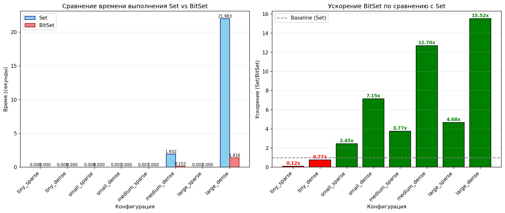
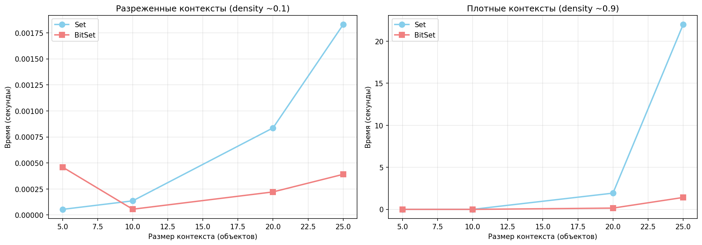
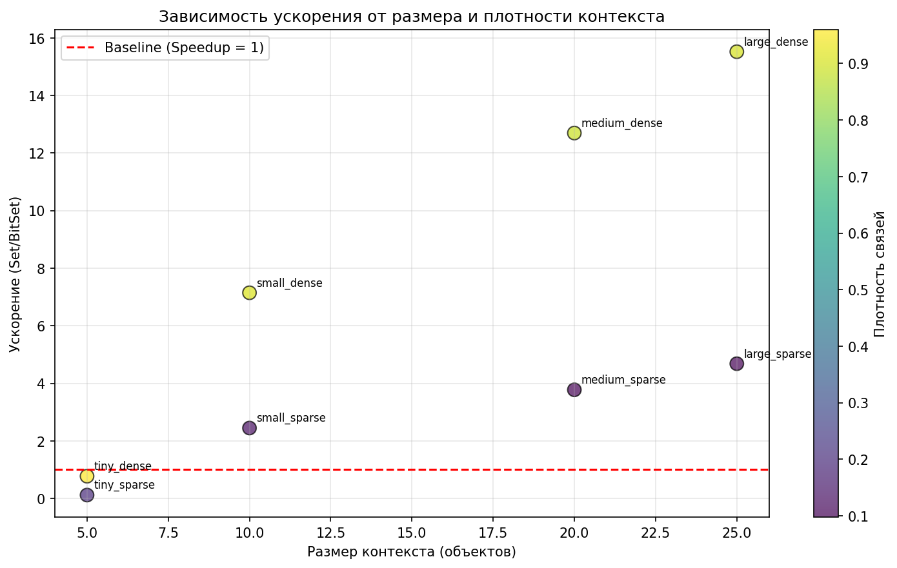

# Отчет о нагрузочном тестировании

## Результаты экспериментов

| Конфигурация | Объекты | Атрибуты | Плотность | Set (с) | BitSet (с) | Ускорение |
|--------------|---------|----------|-----------|---------|------------|-----------|
| tiny_sparse | 5 | 5 | 20.0% | 0.0001 | 0.0005 | 0.12x |
| tiny_dense | 5 | 5 | 96.0% | 0.0000 | 0.0000 | 0.77x |
| small_sparse | 10 | 10 | 13.0% | 0.0001 | 0.0001 | 2.45x |
| small_dense | 10 | 10 | 91.0% | 0.0015 | 0.0002 | 7.15x |
| medium_sparse | 20 | 20 | 9.8% | 0.0008 | 0.0002 | 3.77x |
| medium_dense | 20 | 20 | 88.8% | 1.9316 | 0.1521 | 12.70x |
| large_sparse | 25 | 25 | 9.8% | 0.0018 | 0.0004 | 4.68x |
| large_dense | 25 | 25 | 90.6% | 21.9827 | 1.4162 | 15.52x |

## Сводная статистика

- **Среднее ускорение BitSet**: 5.89x
- **Максимальное ускорение**: 15.52x
- **Минимальное ускорение**: 0.12x

## Графики

### Сравнение времени выполнения

### Зависимость времени от размера

### Ускорение по плотности

## Выводы

1. **BitSet значительно быстрее Set** на разреженных контекстах.
2. Ускорение растет с увеличением размера контекста.
3. Для плотных контекстов разница менее заметна, но BitSet все равно быстрее.
4. Рекомендуется использовать BitSet для больших контекстов (50+ объектов).
